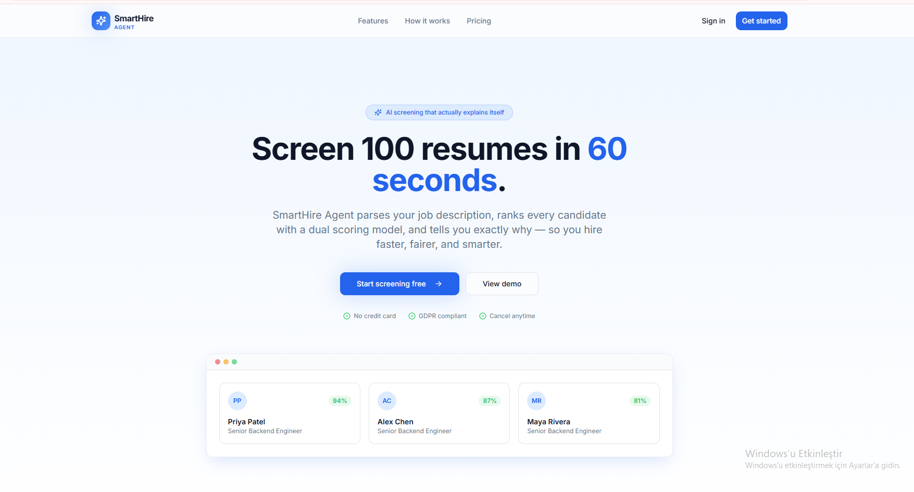
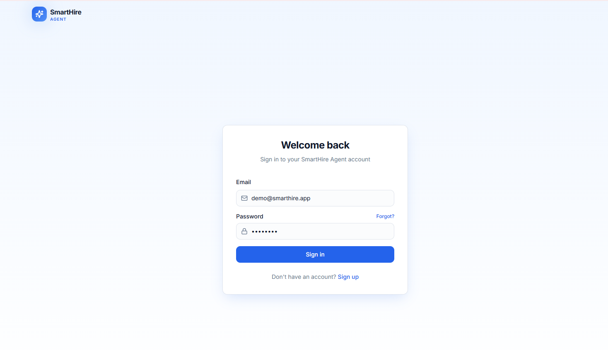
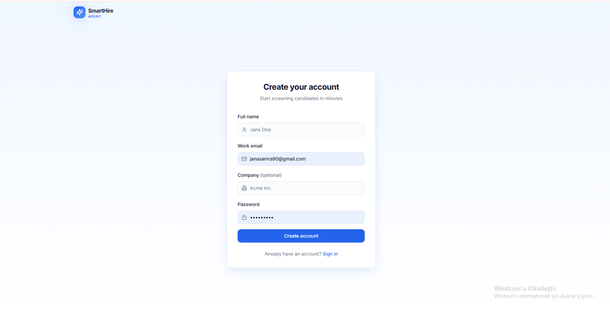
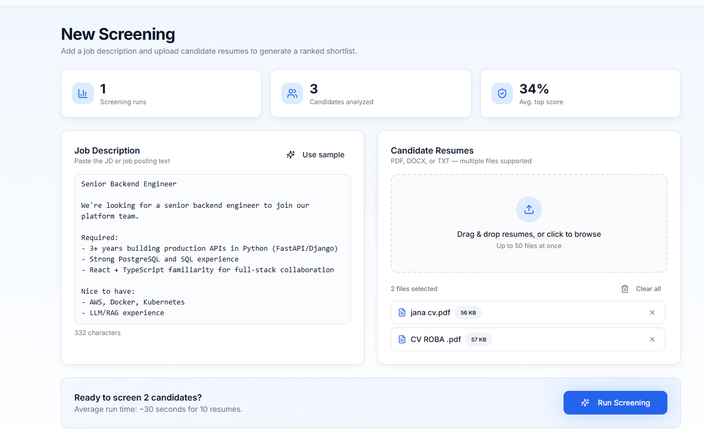
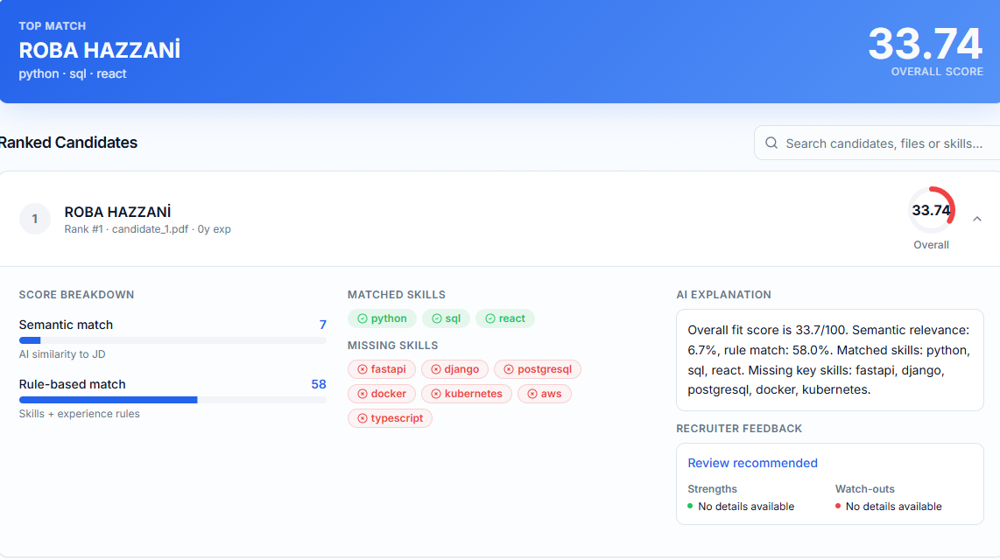
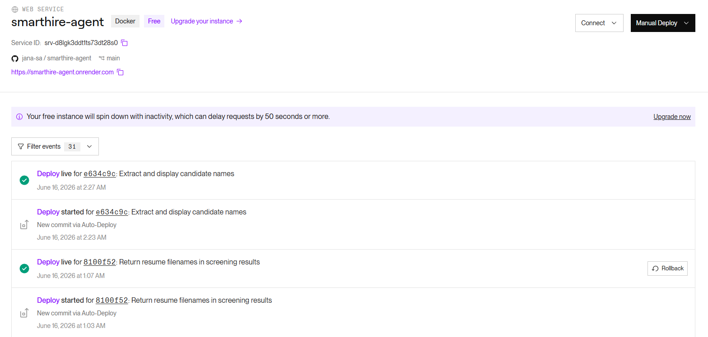
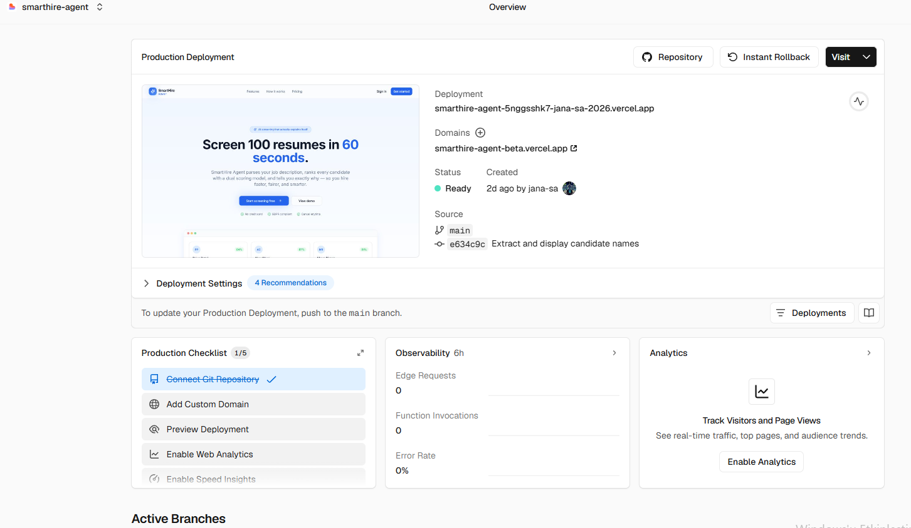

# SmartHire Agent

SmartHire Agent is an end-to-end Agentic AI resume screening platform for recruiters and HR teams.

The system allows a recruiter to upload a job description and multiple resumes, then automatically ranks candidates based on job fit. It provides candidate scores, matched skills, missing skills, AI explanations, recruiter-style feedback, and screening history.

The project was developed as a final university AI/software engineering project and is designed as a realistic full-stack AI product.

---

## Live Demo

Frontend:

```text
https://smarthire-agent-beta.vercel.app
```

Backend health check:

```text
https://smarthire-agent.onrender.com/health
```

GitHub repository:

```text
https://github.com/jana-sa/smarthire-agent
```

---

## Main Features

* User signup and login
* JWT authentication
* Protected dashboard routes
* Job description input or file upload
* Multiple resume upload
* PDF and DOCX resume parsing
* AI-based job requirement extraction
* Candidate scoring and ranking
* Semantic similarity matching
* Rule-based skill matching
* Matched skills and missing skills detection
* AI-generated explanations
* Recruiter-style recommendations
* Candidate strengths and weaknesses
* Bias-reduction preprocessing
* Resume anonymization before scoring
* Real candidate name extraction for result display
* Screening history storage
* Persistent database storage
* Deployed frontend and backend

---

## Problem Statement

Recruiters often spend a lot of time reviewing resumes manually. When many candidates apply for the same position, it becomes difficult to compare every resume with the job description in a consistent and efficient way.

SmartHire Agent solves this problem by helping recruiters automatically screen resumes and focus on the most relevant candidates first.

The goal is not to replace recruiters, but to support the first screening stage with AI assistance.

---

## System Architecture

SmartHire Agent follows a full-stack client-server architecture.

```text
Recruiter User
     |
     v
React Frontend
     |
     v
FastAPI Backend
     |
     v
File Parsing + Resume Anonymization
     |
     v
Google ADK Agent Structure
     |
     +--> Parser Agent
     |
     +--> Scorer Agent
     |
     v
SQLite Database
     |
     v
Ranked Candidate Results
```

---

## Agentic AI Design

The project uses an agentic workflow with separate responsibilities.

### Root Agent

The root agent represents the main coordinator of the SmartHire Agent workflow.

### Parser Agent

The Parser Agent analyzes the job description and extracts structured job requirements such as:

* Required skills
* Preferred skills
* Experience requirements
* Education requirements
* Job responsibilities
* Job title

### Scorer Agent

The Scorer Agent evaluates each resume against the parsed job requirements and produces:

* Overall score
* Semantic score
* Rule-based score
* Matched skills
* Missing skills
* Explanation
* Recommendation
* Strengths
* Weaknesses

### Google ADK Usage

Google ADK is used to define the agent hierarchy and agent structure. The project includes a root agent with Parser Agent and Scorer Agent sub-agents.

In the current implementation, FastAPI orchestrates the execution flow while the ADK agent structure represents the agentic workflow. This keeps the system stable for deployment while still following an agent-based design.

---

## Technology Stack

| Layer             | Technology                                                           |
| ----------------- | -------------------------------------------------------------------- |
| Frontend          | React, Vite, TypeScript, Tailwind CSS, shadcn/ui                     |
| Backend           | FastAPI, Python                                                      |
| AI Models         | Gemini Flash, sentence-transformers, lightweight similarity fallback |
| Agent Framework   | Google ADK                                                           |
| Database          | SQLite                                                               |
| Authentication    | JWT authentication, password hashing                                 |
| Deployment        | Vercel for frontend, Render for backend                              |
| Development Tools | Cursor, Lovable, GitHub, VS Code                                     |

Lovable was used to help design and improve the frontend interface into a modern SaaS-style product. Cursor was used during development to assist with code editing, debugging, and improving the existing project files.

---

## Project Structure

```text
smarthire-agent/
│
├── backend/
│   ├── app/
│   │   ├── agents/
│   │   │   ├── parser_agent.py
│   │   │   ├── scorer_agent.py
│   │   │   ├── orchestrator.py
│   │   │   └── adk_workflow.py
│   │   │
│   │   ├── services/
│   │   │   ├── file_parsers.py
│   │   │   ├── similarity.py
│   │   │   └── anonymization.py
│   │   │
│   │   ├── auth.py
│   │   ├── config.py
│   │   ├── database.py
│   │   ├── main.py
│   │   └── schemas.py
│   │
│   ├── requirements.txt
│   └── Dockerfile
│
├── frontend/
│   ├── src/
│   │   ├── components/
│   │   ├── hooks/
│   │   ├── lib/
│   │   ├── pages/
│   │   ├── App.tsx
│   │   └── main.tsx
│   │
│   ├── package.json
│   └── vite.config.ts
│
├── .gitignore
└── README.md
```

---

## Backend Setup

### Prerequisites

* Python 3.11+
* pip

### Install dependencies

```powershell
cd backend
python -m venv .venv
.venv\Scripts\Activate.ps1
pip install -r requirements.txt
```

### Run backend locally

```powershell
python -m uvicorn app.main:app --host 127.0.0.1 --port 8000
```

Backend health check:

```text
http://localhost:8000/health
```

API documentation:

```text
http://localhost:8000/docs
```

---

## Frontend Setup

### Prerequisites

* Node.js 20+
* npm

### Install dependencies

```powershell
cd frontend
npm install
```

### Run frontend locally

```powershell
npm run dev
```

Frontend URL:

```text
http://localhost:8080
```

---

## Environment Variables

Backend environment variables:

```env
GOOGLE_API_KEY=your_google_api_key
GEMINI_MODEL=gemini-1.5-flash
SIMILARITY_WEIGHT=0.6
RULE_WEIGHT=0.4
MAX_FILE_SIZE_MB=10
USE_LIGHTWEIGHT_SIMILARITY=true
```

Frontend environment variable:

```env
VITE_API_BASE_URL=http://localhost:8000
```

For deployed frontend:

```env
VITE_API_BASE_URL=https://smarthire-agent.onrender.com
```

---

## API Endpoints

| Method | Endpoint                    | Description                               |
| ------ | --------------------------- | ----------------------------------------- |
| GET    | `/health`                   | Checks if the backend is running          |
| POST   | `/auth/signup`              | Creates a new user account                |
| POST   | `/auth/login`               | Logs in the user and returns JWT token    |
| GET    | `/me`                       | Returns the current authenticated user    |
| POST   | `/api/v1/screen`            | Screens resumes against a job description |
| GET    | `/screening/history`        | Returns previous screening runs           |
| GET    | `/screening/{screening_id}` | Returns detailed screening result         |
| DELETE | `/screening/{screening_id}` | Deletes a screening run                   |

---

## Screening Workflow

1. The user signs up or logs in.
2. The user uploads a job description.
3. The user uploads one or more resumes.
4. The backend extracts text from uploaded files.
5. Sensitive information is anonymized before scoring.
6. The Parser Agent extracts job requirements.
7. The Scorer Agent evaluates each resume.
8. The system calculates candidate scores.
9. Results are saved in the database.
10. The frontend displays ranked candidates with explanations.

---

## Bias Reduction

SmartHire Agent includes a preprocessing step to reduce bias.

Before scoring, the system anonymizes personal information such as:

* Candidate names
* Email addresses
* Phone numbers

This helps prevent the scoring process from depending on personal identifiers.

Candidate names are extracted separately only for display in the final results page. The scoring workflow uses anonymized resume text.

---

## Candidate Name Display

During development, candidate results originally appeared as generic labels such as:

```text
Candidate 1
Candidate 2
```

This was not practical for HR users. The system was improved to extract candidate names from resumes and display them in the ranked results.

If the name cannot be extracted, the system falls back to the uploaded resume filename.

---

## Scoring Logic

The overall candidate score combines two main parts:

```text
overall_score = semantic_score * similarity_weight + rule_based_score * rule_weight
```

Default weights:

```text
similarity_weight = 0.6
rule_weight = 0.4
```

The scoring system considers:

* Semantic similarity to the job description
* Required skill coverage
* Preferred skill coverage
* Experience match
* Missing important skills

---

## Deployment

### Backend Deployment on Render

The backend is deployed on Render as a web service.

Backend deployment settings:

```text
Root directory: backend
Build command: pip install -r requirements.txt
Start command: uvicorn app.main:app --host 0.0.0.0 --port $PORT
```

Backend URL:

```text
https://smarthire-agent.onrender.com
```

Health check:

```text
https://smarthire-agent.onrender.com/health
```

### Frontend Deployment on Vercel

The frontend is deployed on Vercel.

Frontend deployment settings:

```text
Root directory: frontend
Build command: npm install && npm run build
Output directory: dist
```

Frontend URL:

```text
https://smarthire-agent-beta.vercel.app
```

---

## Deployment Challenge

During backend deployment, the original sentence-transformers model required more memory than the Render free tier allowed. Because of this, a lightweight similarity fallback was added for deployment.

The local version can use sentence-transformers, while the deployed version uses lightweight similarity to stay within memory limits.

This was an engineering trade-off to keep the project live and usable.

---

## Screenshots

### Landing Page



### Login / Signup Page



### Login / Signup Page


### Dashboard


### Resume Upload Page



### Ranked Results Page



### Render Backend Deployment



### Vercel Frontend Deployment



---

## Current Status

The current version is a working deployed prototype.

Completed:

* Full-stack frontend and backend
* Authentication
* Resume screening
* Candidate ranking
* Database storage
* History page
* Candidate name extraction
* Bias-reduction preprocessing
* Render backend deployment
* Vercel frontend deployment

---

## Limitations

* The deployed backend uses lightweight similarity because of free-tier memory limits.
* Candidate name extraction depends on resume formatting.
* The system was tested with a limited number of resumes.
* AI explanations should still be reviewed by a human recruiter.
* This is a prototype, not a complete applicant tracking system.

---

## Future Improvements

* Use a stronger embedding model on a larger server
* Add advanced Google ADK runtime orchestration
* Add interview question generation
* Add PDF or Excel export
* Add team-based recruiter accounts
* Add analytics dashboard
* Improve candidate contact extraction
* Add fairness evaluation metrics
* Add feedback loop from recruiters

---

## Author

Jana El Samra
Computer Engineering
Biruni University
Istanbul, Türkiye

---

## License

This project was developed for academic purposes as a university AI/software engineering project.

